# 🎓 Learn Hub — Online Learning Management System

Learn Hub is a modern, full-stack Online Learning Management System (LMS) built with **Java Spring Boot** (Backend) and **HTML/CSS/JS** with a premium **Glassmorphism** UI (Frontend). 

This platform allows instructors to create and sell courses, students to enroll and earn certificates, and administrators to oversee the entire platform with robust analytics and financial tracking.

---

## 🚀 Features

- **Role-Based Access Control (RBAC):** Three distinct roles: `Admin`, `Teacher`, and `Student`.
- **Course Management:** Teachers can create courses, upload video lessons, and build interactive quizzes.
- **Manual Payment Gateway:** Students can enroll in paid courses by submitting transaction IDs (e.g., bKash, Nagad, Bank).
- **Enrollment Approval System:** Admins and Teachers can approve or reject pending enrollment requests.
- **Financial & Commission System:** 10% site commission on every paid enrollment.
- **Teacher Withdrawals:** Teachers can request withdrawals for their earnings.
- **Automated Certification:** Students automatically receive downloadable certificates upon passing course exams (≥ 50% score).
- **Responsive UI/UX:** Premium dark-themed, glassmorphism design that works seamlessly across desktop and mobile devices.

---

## 📸 Step-by-Step Walkthrough & Screenshots

Create a folder named `screenshots` in the root of your repository and place your images there. Here is the step-by-step breakdown of how the platform works:

### 1. Landing & Authentication
The entry point for all users. Features a dynamic hero section and displays available public courses.
- **Landing Page:** 
  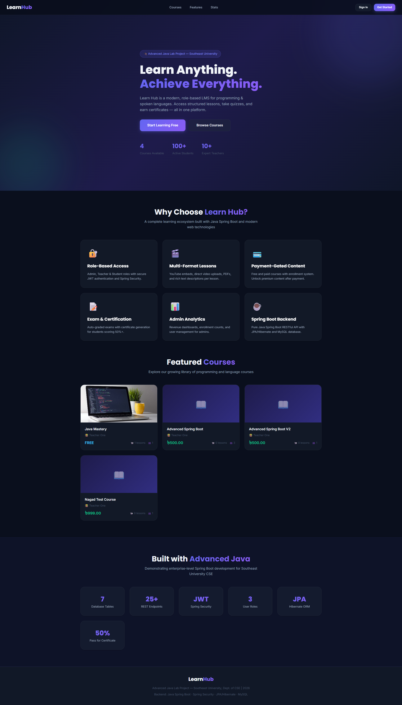
- **Sign In / Sign Up:** 
  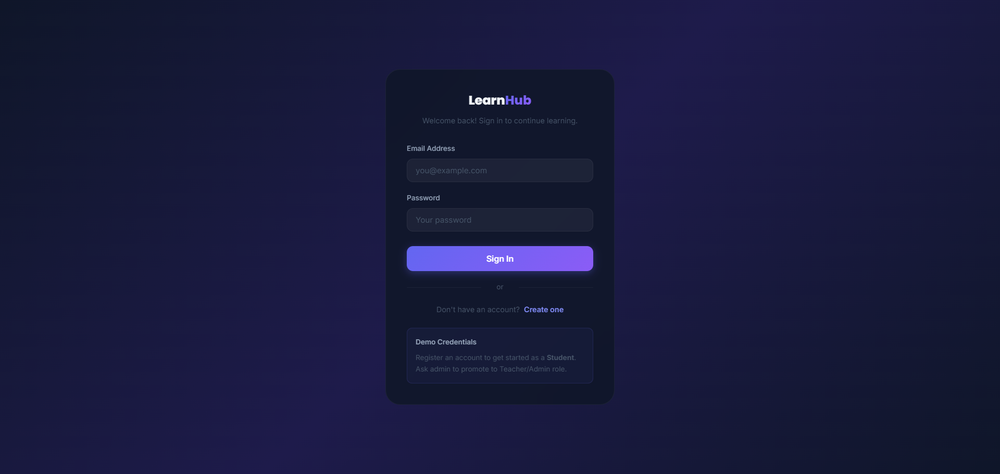

### 2. Admin Dashboard
The central control hub for the platform owner.
- **Platform Analytics:** View total revenue, site commission, and user statistics.
  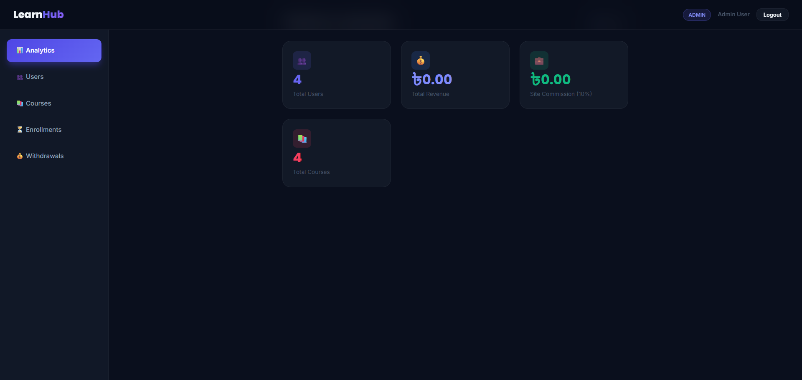
- **User Management:** Ban/Activate users and assign roles.
  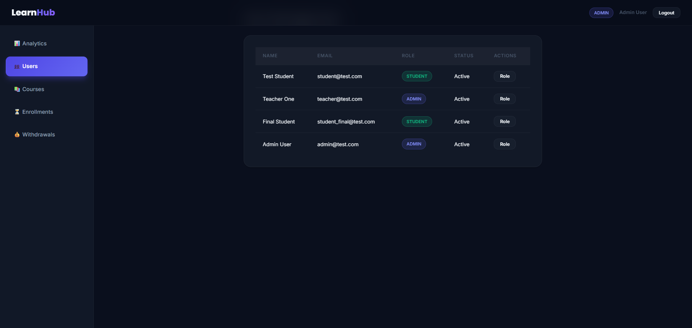
- **Pending Enrollments:** Approve or reject manual payment submissions.
  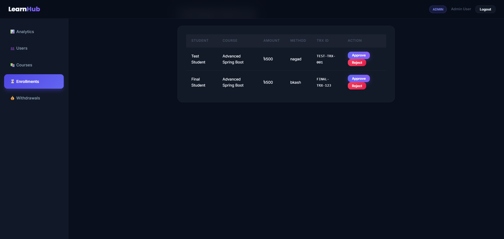
- **Withdrawal Requests:** Approve teacher payout requests.
  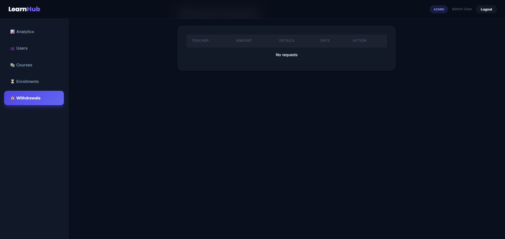

### 3. Teacher Dashboard
The dedicated portal for instructors to manage their content and earnings.
- **Teacher Overview:** Quick stats on active courses and total students.
  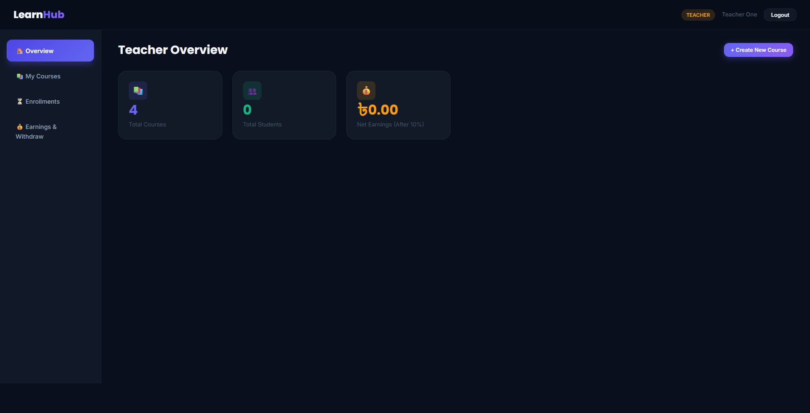
- **Course Editor:** Add lessons, YouTube links, and multiple-choice quizzes.
  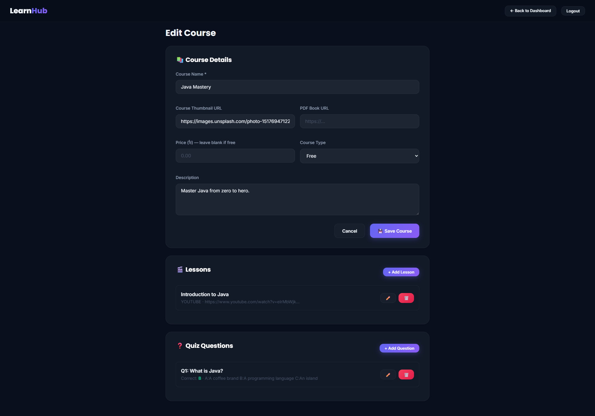
- **Enrollment Approvals:** Teachers can directly approve students who purchased their specific courses.
  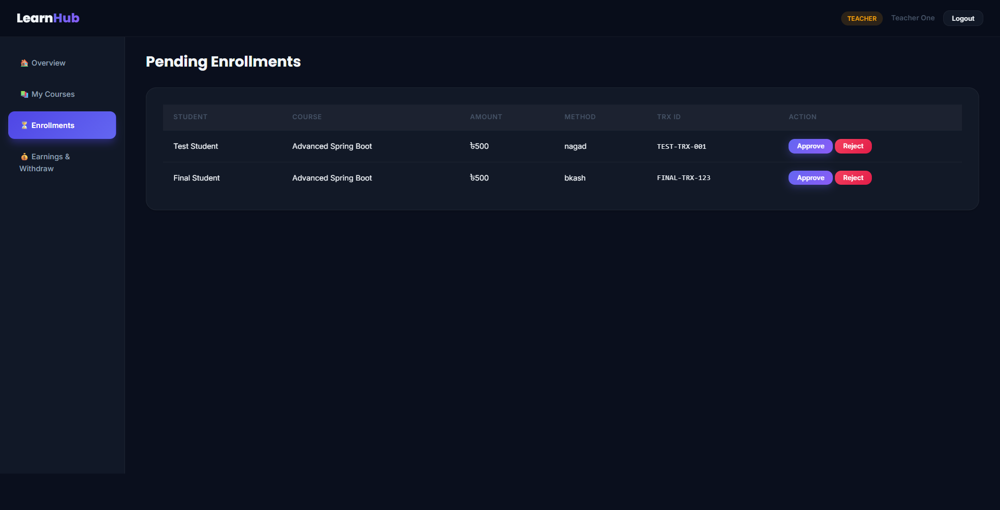
- **Earnings & Withdrawals:** Track 90% net earnings and request payouts.
  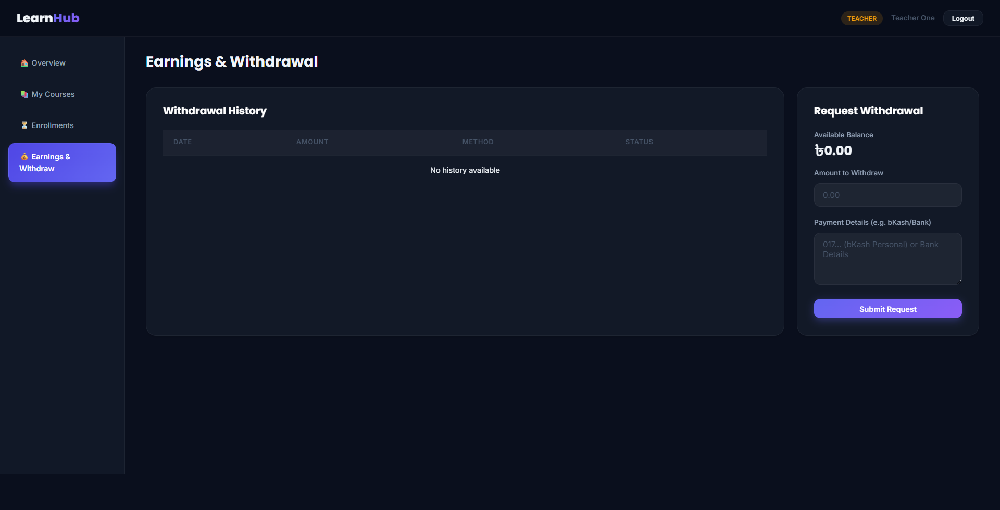

### 4. Student Dashboard
The personalized learning space for students.
- **Course Browser:** Search and filter through available courses.
  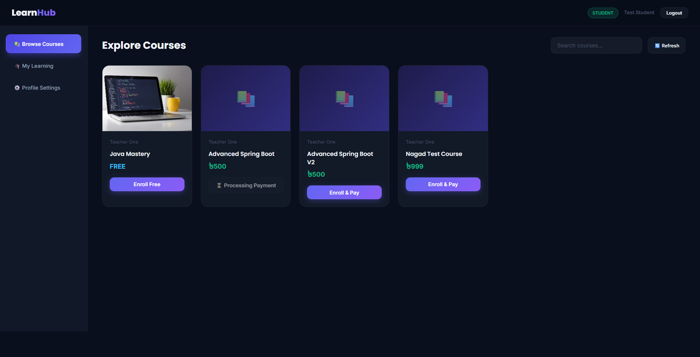
- **Payment Gateway:** Submit Transaction IDs for manual approval via bKash, Nagad, or Bank.
  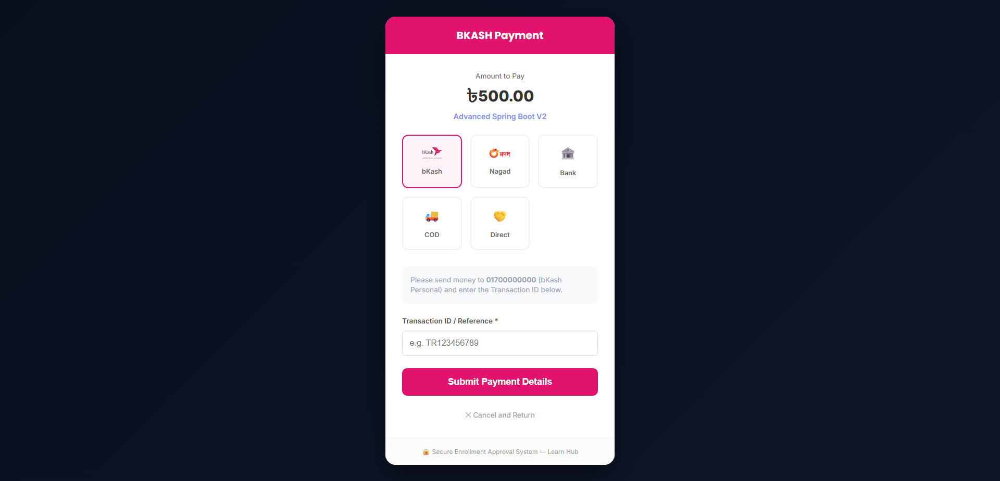
- **Course Player & Exam:** Watch lessons and take the final exam.
  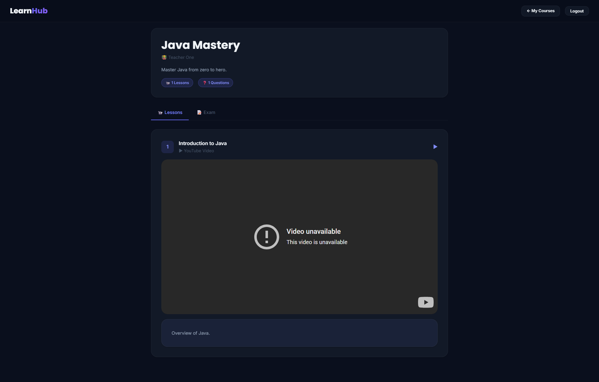
- **Certificate:** View and print the achievement certificate upon passing.
  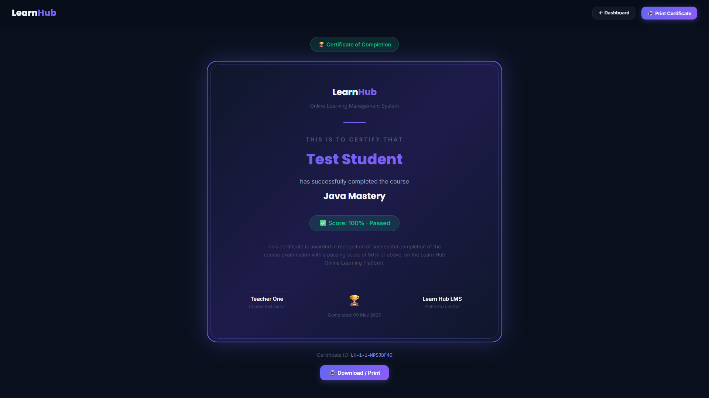

### 5. Global Profile
All users have access to their profile to update their details and passwords.
- **User Profile:** 
  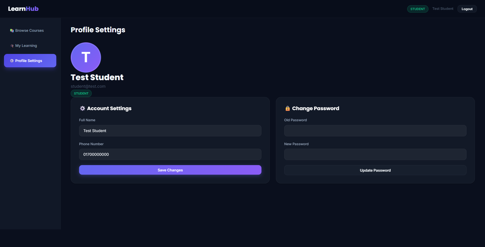

---

## 🛠️ Tech Stack

**Backend:**
- Java 17+
- Spring Boot 4.x
- Spring Security & JWT (JSON Web Tokens)
- Spring Data JPA / Hibernate
- MySQL Database

**Frontend:**
- HTML5 & Vanilla Javascript
- CSS3 (Custom Glassmorphism UI, Flexbox, CSS Grid)
- FontAwesome Icons
- Google Fonts (Inter, Poppins)

---

## ⚙️ Installation & Setup

1. **Clone the repository:**
   ```bash
   git clone https://github.com/yourusername/LearnHub.git
   cd LearnHub
   ```

2. **Configure Database:**
   - Ensure MySQL is installed and running.
   - Update the `src/main/resources/application.properties` with your database credentials:
     ```properties
     spring.datasource.url=jdbc:mysql://localhost:3306/learn_hub?createDatabaseIfNotExist=true&allowPublicKeyRetrieval=true
     spring.datasource.username=root
     spring.datasource.password=your_password
     ```

3. **Run the Application:**
   Using Maven wrapper:
   ```bash
   ./mvnw spring-boot:run
   ```

4. **Access the App:**
   Open your browser and navigate to: `http://localhost:8080`

---

## 🤝 Contribution
Contributions, issues, and feature requests are welcome! Feel free to check the [issues page](https://github.com/yourusername/LearnHub/issues).
